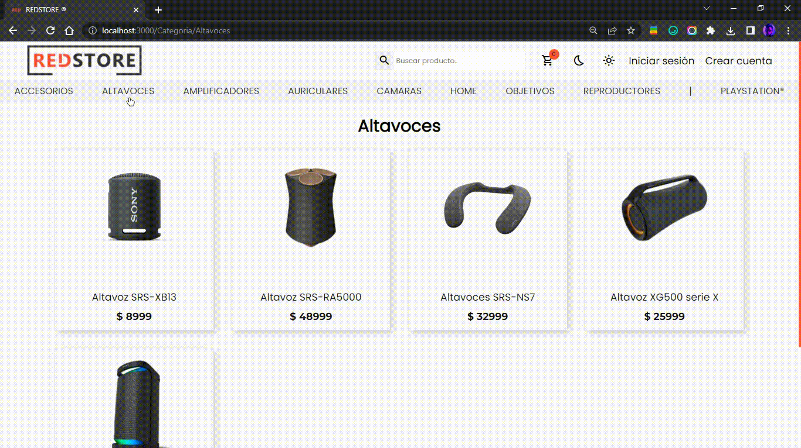

# RedStore®

E-commerce de productos Sony.

## Demo ¬

## Instalación ¬

- Fork del repositorio.
- Clone del repositorio.
- Sobre el root del proyecto, usar el comando `npm install` para instalar las dependencias del mismo.
- Usar `npm start` para correr el proyecto, disponible en http://localhost:3000/

## Dependencias ¬

- [React Router Dom](https://v5.reactrouter.com/web/guides/quick-start).
- [Google Fonts](https://fonts.google.com/).
- [Font Awesome](https://fontawesome.com/).

## Autor ¬

- [@luccasassa](https://github.com/luccasassa/)